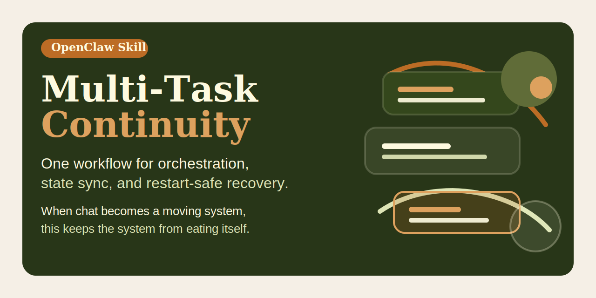

# Multi-Task Continuity

English | [简体中文](README.zh-CN.md)




An OpenClaw skill for running multiple user requests as one coordinated, restart-safe workflow instead of a chat-shaped pileup.

## Quick pitch

One workflow for orchestration, state sync, and restart-safe recovery.
When chat becomes a moving system, this keeps the system from eating itself.

## Why this exists

Most agents can either do multitasking or do continuity, but not both at the same time without turning state into compost.

One skill says how to prioritize work. Another says how to survive restarts. Another says how to keep `TODO.md` and `memory/active-task.md` from drifting apart. Individually, each piece helps. In practice, the real failure mode happens in the gaps between them: the agent starts parallel work, forgets to persist the active lane, restarts mid-flight, and comes back speaking confidently about the wrong task.

`multi-task-continuity` closes that gap.

It combines three behaviors into one operational workflow:

- orchestrate multiple incoming tasks intelligently
- persist the real state as priorities and blockers change
- resume the correct top task after a restart, then rebuild the broader queue

This is the umbrella skill for agents that need to behave like competent operators under real chat conditions.

## Works independently

`multi-task-continuity` is a complete skill, not a meta-readme that assumes the other repos are installed.

Use this repo by itself when you want the full operating model in one package:

- task triage and prioritization
- safe parallel execution
- continuity-file maintenance
- restart-safe recovery
- staged progress reporting

The smaller repos remain useful as focused components, but this umbrella skill does not depend on them to make sense.

## What the skill teaches

The skill tells the agent to:

- split incoming requests into real tasks instead of treating chat as FIFO
- choose safe parallelism and launch long-running valuable work early
- keep the main thread on orchestration and user communication
- write per-chat unfinished state to `TODO.md`
- write the top resume-first lane to `memory/active-task.md`
- schedule restart fallbacks when intentional restarts would otherwise risk dropping work
- send staged progress updates instead of waiting for a grand finale
- repair continuity state before continuing if the files drift apart

## When to use it

Use `multi-task-continuity` when:

- a user sends multiple tasks across separate messages
- some work is long-running, parallelizable, or blocker-sensitive
- priorities may change during execution
- the active plan must survive restarts or session resets
- `TODO.md` and `memory/active-task.md` need to stay aligned throughout the work

Do not use it for trivial one-shot tasks. That would be like bringing air traffic control to a bicycle ride.

## Workflow overview

### 1. Build the task map

Split the incoming requests into discrete tasks and capture:

- goal
- urgency
- dependencies
- conflicts
- likely runtime
- parallel safety
- expected user-visible output

### 2. Choose the active lanes

Default ordering:

1. unblockers and urgent work
2. long-running independent work worth starting early
3. quick wins that fit into wait windows
4. cleanup and secondary polish

### 3. Persist the truth

- write the per-chat queue into `TODO.md`
- write the single resume-first task into `memory/active-task.md`
- update both when priorities, blockers, IDs, or next steps change materially

### 4. Report progress

Tell the user:

- what finished
- what is still running
- what is blocked
- what changed in priority
- what happens next

### 5. Recover after restart

- resume the top task from `memory/active-task.md`
- send the queued restart update in the first substantive reply
- rebuild the remaining queue from `TODO.md`
- clear stale fallback state once recovery succeeds

## Example scenarios

### Scenario 1: mixed short and long work

User sends:

- "Fix the config bug"
- "Also summarize this log"
- "And start a PR review"

A good agent should:

1. inspect whether the config bug is a blocker
2. launch the PR review as a background lane if safe
3. summarize the log while the longer lane runs
4. write the current queue to `TODO.md`
5. report the config result immediately when it lands

### Scenario 2: urgent interruption

User sends ongoing work, then adds:

- "Drop that for now, production is failing"

A good agent should:

1. re-rank the queue immediately
2. rewrite `TODO.md` so the production issue becomes the main active lane
3. rewrite `memory/active-task.md` so restart recovery points at the production issue
4. tell the user what changed and what is running now

### Scenario 3: restart in the middle of active work

User sends:

- "Fix the deploy script"
- "Review this PR too"
- "And keep me posted if a restart interrupts anything"

A good agent should:

1. inspect the deploy issue first if it is blocker-sensitive
2. launch the PR review in a background lane if safe
3. write the current chat queue to `TODO.md`
4. write the deploy lane to `memory/active-task.md` if it is the top task
5. if a restart is planned, schedule the fallback nudge and record its `jobId`
6. after restart, resume the deploy lane first and then continue the review lane

## Related skills

These are related, not required:

- `task-orchestrator`: focused scheduling and prioritization skill — <https://github.com/ruanrrn/task-orchestrator>
- `task-state-sync`: focused continuity-file maintenance skill — <https://github.com/ruanrrn/task-state-sync>

Use this umbrella repo when you want the whole operating model in one place.

## Social preview

Suggested social preview asset: `assets/social-preview.svg`

Suggested one-line copy:

> One workflow for orchestration, state sync, and restart-safe recovery.

GitHub note:

- The current `gh` CLI and GraphQL `UpdateRepositoryInput` do not expose a writable custom social preview field.
- To use this image as the repository social preview, upload `assets/social-preview.svg` manually in the repo settings UI.

## What you get

- `multi-task-continuity/` - the skill source
- `dist/multi-task-continuity.skill` - packaged artifact ready to import

## Install

Use either path:

1. Import `dist/multi-task-continuity.skill` into an OpenClaw environment.
2. Copy `multi-task-continuity/` into your skills directory if you want the editable source.

## Repository layout

```text
multi-task-continuity/
├── LICENSE
├── README.md
├── README.zh-CN.md
├── assets/
│   └── social-preview.svg
├── multi-task-continuity/
│   └── SKILL.md
└── dist/
    └── multi-task-continuity.skill
```

## Contributing

See `CONTRIBUTING.md` for contribution scope, PR expectations, and how to keep this repo coherent as a standalone umbrella workflow.

## Release hygiene

- Regenerate `dist/multi-task-continuity.skill` after each material skill change
- Keep the repo focused on the umbrella workflow only
- Keep the README examples aligned with the actual workflow in `SKILL.md`
- Update links to related skills when those repos change

## Repository

- GitHub: `https://github.com/ruanrrn/multi-task-continuity`
- License: MIT
